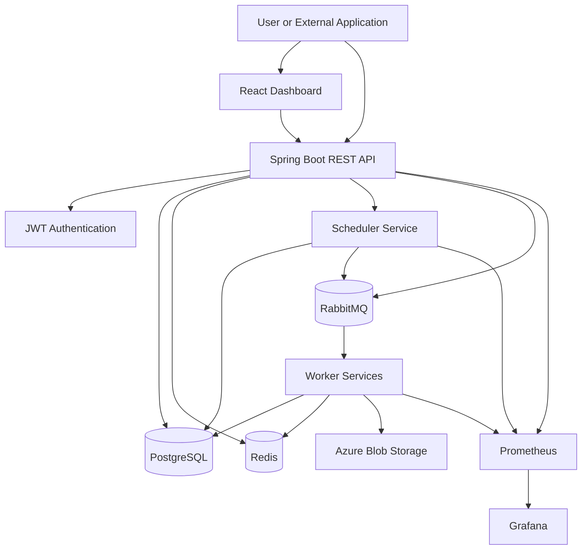
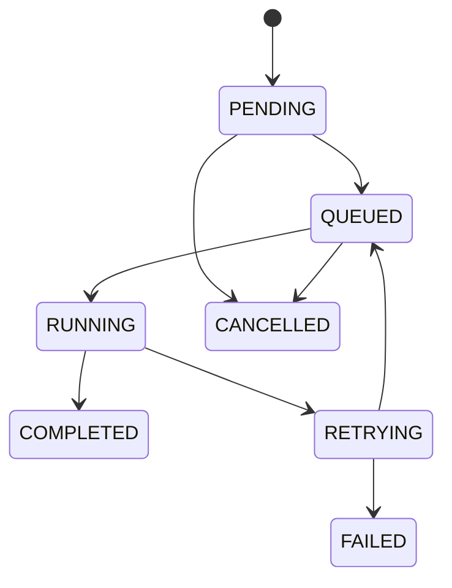
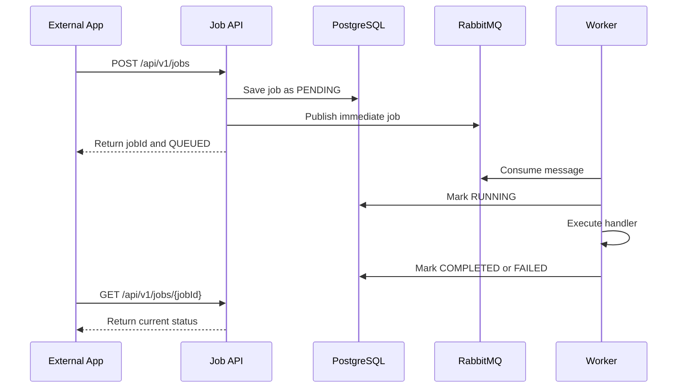

# High-Level Design: Distributed Job Scheduling Platform

> **Superseded for implementation.** Use `job-platform-design/00-final-hld.md` and the complete `job-platform-design` pack. They correct this earlier draft by making the transactional outbox part of the initial reliable path, explicitly defining at-least-once delivery, narrowing MVP scheduling to immediate and one-time UTC jobs, and documenting single-VM limitations.

## 1. Project Summary

Build a reusable, full-stack background-job processing platform. External applications and users can submit tasks through REST APIs or the web dashboard. The platform queues, schedules, executes, retries, tracks, and monitors those tasks without blocking the calling application.

Example jobs:

- Generate a large sales report
- Send bulk emails or notifications
- Process uploaded files
- Run a database backup
- Generate PDF invoices

This is a standalone platform that can be integrated with other applications through REST APIs, webhooks, and API keys.

## 2. Fixed Technology Stack

- Frontend: React + TypeScript
- Backend: Java 21 + Spring Boot
- Authentication: Spring Security with JWT
- Database: PostgreSQL
- Message broker: RabbitMQ
- Cache and distributed locks: Redis
- Monitoring: Prometheus + Grafana
- Packaging: Docker and Docker Compose
- Deployment: Azure Linux VM running Docker
- CI/CD: GitHub Actions
- Optional later stage: Kubernetes/k3s; AKS only if free credits are available

Do not add Kafka, microservices, AKS, or managed Azure services in the first implementation unless explicitly requested. RabbitMQ is sufficient for the MVP and keeps the infrastructure affordable.

## 3. Goals

### Functional goals

1. Allow users and external applications to submit jobs.
2. Support immediate, scheduled, and recurring jobs.
3. Process jobs asynchronously using workers.
4. Track the complete job lifecycle.
5. Support priorities, cancellation, retries, and execution history.
6. Provide a dashboard for job and worker monitoring.
7. Expose metrics and health information.

### Engineering goals

- Demonstrate asynchronous processing and queue-based architecture.
- Prevent duplicate execution using idempotency and distributed locking.
- Handle worker failure and temporary job failure.
- Make workers horizontally scalable.
- Keep API response time independent of long-running job execution.

### Out of scope for MVP

- Arbitrary user-supplied code execution
- Multi-region deployment
- High availability across multiple cloud regions
- Kubernetes production cluster
- Billing or payment functionality
- Complex workflow DAGs

Only predefined safe job types should be supported. Do not execute arbitrary code received in a request.

## 4. High-Level Architecture



## 5. Component Responsibilities

### 5.1 React frontend

The dashboard must provide:

- Login and logout
- Job creation form
- Job list with filtering by status, type, priority, and date
- Job detail page
- Retry and cancellation actions
- Execution attempts and error logs
- Schedule management
- Worker-health page
- Metrics summary and links to Grafana

The frontend must not contain business logic for job execution. It only calls backend APIs.

### 5.2 API service

The Spring Boot API service must:

- Authenticate users and validate API keys.
- Validate job type, payload, priority, and schedule.
- Persist job metadata in PostgreSQL.
- Publish executable jobs to RabbitMQ when appropriate.
- Return a job ID immediately for asynchronous work.
- Expose status, retry, cancellation, schedule, and log APIs.
- Enforce ownership and role-based access control.
- Apply request rate limits.

### 5.3 Scheduler service

The scheduler detects jobs whose `scheduled_at` time has arrived and publishes them to RabbitMQ.

For recurring jobs, it calculates the next execution time and creates the next execution record. It must use a Redis lock so two scheduler instances do not publish the same scheduled job.

For the MVP, the scheduler may run as a separate Spring Boot process or as a separate application profile in the same repository.

### 5.4 RabbitMQ

RabbitMQ is the asynchronous transport layer.

Queues:

- `jobs.high`
- `jobs.default`
- `jobs.low`
- `jobs.retry`
- `jobs.dead-letter`

Use durable queues, persistent messages, manual acknowledgements, retry routing, and a dead-letter exchange.

### 5.5 Workers

Workers consume jobs and execute predefined handlers.

Initial handlers:

- `GENERATE_REPORT`
- `SEND_EMAIL`
- `PROCESS_FILE`
- `SEND_NOTIFICATION`

Worker flow:

1. Consume a message.
2. Acquire an idempotency lock.
3. Mark the execution as `RUNNING`.
4. Execute the registered handler.
5. Store output or result metadata.
6. Mark the execution as `COMPLETED` or `FAILED`.
7. Acknowledge the RabbitMQ message.

Workers must send heartbeats. A worker that stops sending heartbeats is considered unhealthy.

### 5.6 PostgreSQL

PostgreSQL is the source of truth for users, jobs, schedules, execution history, and audit records.

### 5.7 Redis

Redis is used for:

- Job-status caching
- Scheduler leader/distributed locks
- Idempotency locks
- Rate limiting
- Worker heartbeat data

Redis must not be the only place where important job state is stored.

### 5.8 Prometheus and Grafana

Expose metrics from the API, scheduler, and workers.

Required metrics:

- Jobs submitted per minute
- Jobs completed and failed
- Queue depth
- Job execution duration
- Retry count
- Worker heartbeat status
- API request latency
- API error rate

## 6. Job Lifecycle



Statuses:

- `PENDING`: job is stored but not yet published.
- `QUEUED`: job is available in RabbitMQ.
- `RUNNING`: worker is processing the job.
- `COMPLETED`: execution succeeded.
- `RETRYING`: execution failed temporarily and will be retried.
- `FAILED`: maximum retry count was reached.
- `CANCELLED`: user cancelled the job before execution.

## 7. Job Submission Flow



For scheduled jobs, the scheduler publishes to RabbitMQ only when the scheduled time arrives.

## 8. External Integration

External applications integrate using REST APIs.

Example request:

```http
POST /api/v1/jobs
Authorization: Bearer <token>
Idempotency-Key: order-email-ORD123
Content-Type: application/json
```

```json
{
  "jobType": "SEND_EMAIL",
  "payload": {
    "template": "ORDER_CONFIRMED",
    "orderId": "ORD123",
    "recipient": "user@example.com"
  },
  "priority": "HIGH",
  "maxRetries": 3
}
```

Response:

```json
{
  "jobId": "job_01JXYZ",
  "status": "QUEUED",
  "statusUrl": "/api/v1/jobs/job_01JXYZ"
}
```

Optional webhook support:

- The client supplies a webhook URL when creating a job.
- The platform sends a signed callback after completion or permanent failure.
- Webhook delivery itself must be retried.

## 9. API Specification

| Method | Endpoint | Purpose |
|---|---|---|
| `POST` | `/api/v1/auth/register` | Register a user |
| `POST` | `/api/v1/auth/login` | Obtain JWT |
| `POST` | `/api/v1/jobs` | Submit a job |
| `GET` | `/api/v1/jobs` | List jobs |
| `GET` | `/api/v1/jobs/{id}` | Get job status |
| `POST` | `/api/v1/jobs/{id}/retry` | Retry a failed job |
| `POST` | `/api/v1/jobs/{id}/cancel` | Cancel a pending/queued job |
| `GET` | `/api/v1/jobs/{id}/executions` | View execution attempts |
| `GET` | `/api/v1/jobs/{id}/logs` | View execution logs |
| `POST` | `/api/v1/schedules` | Create recurring schedule |
| `GET` | `/api/v1/schedules` | List schedules |
| `PATCH` | `/api/v1/schedules/{id}` | Pause or update schedule |
| `DELETE` | `/api/v1/schedules/{id}` | Delete schedule |
| `GET` | `/api/v1/workers` | View worker health |
| `GET` | `/actuator/health` | Health check |
| `GET` | `/actuator/prometheus` | Prometheus metrics |

All APIs must use consistent error responses, pagination, validation, and correlation IDs.

## 10. Database Model

### `users`

- `id`
- `email`
- `password_hash`
- `role`
- `created_at`

### `api_clients`

- `id`
- `name`
- `key_hash`
- `owner_user_id`
- `status`
- `created_at`

### `jobs`

- `id`
- `owner_id`
- `job_type`
- `payload_json`
- `status`
- `priority`
- `scheduled_at`
- `max_retries`
- `retry_count`
- `idempotency_key`
- `webhook_url`
- `created_at`
- `updated_at`
- `completed_at`

### `job_executions`

- `id`
- `job_id`
- `worker_id`
- `attempt_number`
- `status`
- `started_at`
- `finished_at`
- `error_message`
- `result_location`

### `schedules`

- `id`
- `owner_id`
- `job_template_json`
- `cron_expression`
- `timezone`
- `active`
- `next_run_at`
- `created_at`

### `workers`

- `id`
- `worker_type`
- `status`
- `last_heartbeat_at`
- `registered_at`

Indexes are required on `jobs(status, priority, created_at)`, `jobs(scheduled_at)`, `job_executions(job_id)`, and `schedules(next_run_at, active)`.

## 11. Reliability and Failure Handling

### Retry policy

Use exponential backoff, for example:

```text
Attempt 1: 10 seconds
Attempt 2: 30 seconds
Attempt 3: 2 minutes
```

After the maximum attempts, move the message to the dead-letter queue and mark the job `FAILED`.

### Duplicate execution

Use the client-provided idempotency key and a Redis lock. A job handler must be idempotent wherever possible.

### Worker failure

If a worker crashes before acknowledging a message, RabbitMQ redelivers the message. The platform must detect stale `RUNNING` executions and either requeue them or mark them for review.

### Scheduler failure

Use a Redis lock/lease so only one scheduler instance publishes a scheduled job. On restart, the scheduler scans for overdue jobs.

### Database failure

The API should fail safely, return a clear error, and avoid publishing a queue message before the job record is durably created. Implement the outbox pattern as a later reliability enhancement.

## 12. Security Requirements

- Hash passwords using BCrypt or Argon2.
- Use JWT expiry and refresh-token rotation.
- Hash stored API keys; never store raw keys.
- Validate job type and payload schema.
- Enforce user ownership on every job query.
- Use HTTPS in Azure.
- Store secrets in environment variables for development and Azure Key Vault later.
- Do not log passwords, tokens, API keys, or sensitive payloads.
- Sign webhook requests with HMAC.
- Apply rate limits to job submission APIs.

## 13. Performance and Scaling

The API returns after accepting the job; it does not wait for job completion.

Scale workers horizontally when queue depth increases:

```text
Queue depth rises → Add worker replicas → Jobs process in parallel
```

Use pagination for job lists and indexes for status/schedule queries. Cache frequently requested job status in Redis, but always preserve PostgreSQL as the source of truth.

The MVP will run on one Azure VM. Horizontal scaling will be demonstrated locally using multiple worker containers. Kubernetes manifests may be added after the Docker version is stable.

## 14. Deployment Plan

### Local development

Use Docker Compose with:

- React frontend
- Spring Boot API
- Scheduler
- Worker
- PostgreSQL
- RabbitMQ
- Redis
- Prometheus
- Grafana

### Azure deployment

Use one Azure Linux VM for the first public demo. Run the application stack with Docker Compose and expose only the frontend/API through HTTPS. Keep PostgreSQL, RabbitMQ, Redis, Prometheus, and Grafana on a private Docker network.

Use Azure Blob Storage for large generated files and logs. Configure budget alerts and avoid paid managed services unless explicitly approved.

### CI/CD

GitHub Actions pipeline:

1. Run unit tests.
2. Run integration tests using containers.
3. Build backend and frontend.
4. Build Docker images.
5. Push images to a container registry.
6. SSH/deploy the selected version to the Azure VM.
7. Run health checks.

## 15. Development Phases

### Phase 1: Foundation

- Create repository and project structure.
- Implement Spring Boot API.
- Add PostgreSQL and Flyway migrations.
- Add user registration and JWT login.

### Phase 2: Core jobs

- Create job model and APIs.
- Add RabbitMQ.
- Implement one worker and one job type.
- Implement status updates.

### Phase 3: Reliability

- Add priorities.
- Add retry and exponential backoff.
- Add dead-letter queue.
- Add idempotency.
- Add cancellation.

### Phase 4: Scheduling

- Add one-time scheduled jobs.
- Add recurring cron schedules.
- Add scheduler locking.

### Phase 5: Dashboard

- Build React dashboard.
- Add job filtering, details, retries, cancellation, and logs.
- Add worker-health view.

### Phase 6: Observability

- Add Prometheus metrics.
- Create Grafana dashboards.
- Add structured logging and correlation IDs.

### Phase 7: Deployment

- Dockerize all services.
- Deploy to an Azure VM.
- Configure HTTPS, secrets, health checks, and CI/CD.

### Phase 8: Demonstration and documentation

- Load-test the queue with multiple workers.
- Demonstrate worker failure and automatic retry.
- Demonstrate scheduled execution.
- Document architecture and trade-offs.

## 16. Definition of Done

The project is complete when:

- A user can log in through the dashboard.
- A user can submit an immediate or scheduled job.
- The job is persisted and processed asynchronously.
- At least four predefined job types work.
- Job status changes are visible in the dashboard.
- Failed jobs retry automatically.
- Permanently failed jobs enter the dead-letter queue.
- Duplicate submissions are handled idempotently.
- Worker health and queue metrics appear in Grafana.
- The project runs with Docker Compose.
- A public demo runs on Azure within the available free allowance.
- README contains setup steps, API documentation, architecture diagrams, and design trade-offs.

## 17. Resume Description

> Built and deployed a full-stack distributed job scheduling platform using Java Spring Boot, React, RabbitMQ, PostgreSQL, Redis, Docker, and Azure. Implemented asynchronous job execution, scheduled and recurring tasks, priority queues, retries with exponential backoff, dead-letter handling, idempotency controls, worker health monitoring, REST integration APIs, and Prometheus-Grafana observability.

## 18. Instruction to Codex

Implement this project in phases. Start with Phase 1 and Phase 2 only. Do not implement advanced features until the basic end-to-end flow works:

```text
Submit job → Persist job → Publish to RabbitMQ → Worker consumes → Update status → Query status
```

Use clean, production-style code, meaningful tests, migrations, environment-based configuration, Docker Compose, and a clear README. Ask before changing the fixed technology stack or expanding the scope.
