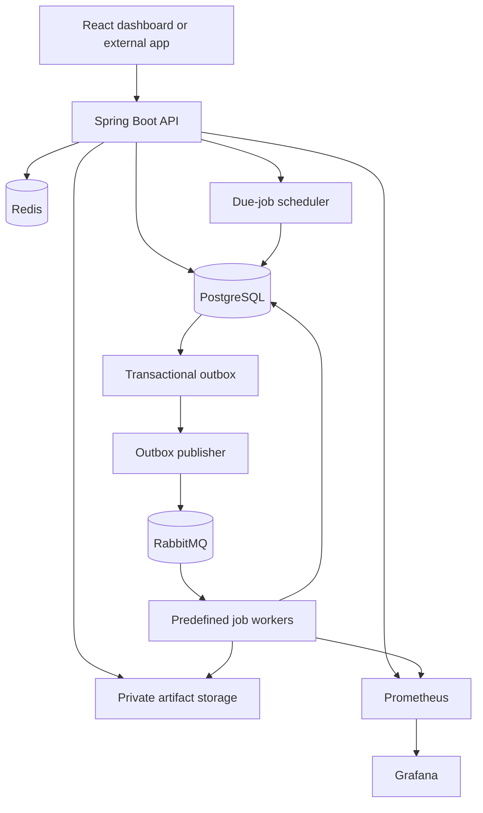

# Final High-Level Design

## Product

Data Processing and Report Automation Platform: a personal, API-first web application that lets users upload CSV files, process them asynchronously, and download real outputs. The reusable job platform is its backend execution engine.

## MVP scope

- Personal accounts with project-scoped jobs and API keys
- React dashboard plus REST API integration
- Secure CSV upload, validation/normalization, error reports, and authorised downloads
- `PROCESS_FILE` is the first fully implemented safe server-side handler
- Immediate and one-time scheduled jobs in UTC
- Priorities, quotas, status tracking, retries, DLQ, cancellation before execution, and manual retry
- Docker Compose locally and on one Azure Linux VM

Not MVP: organizations, cron recurrence, arbitrary code, HA, AKS, or paid managed runtime services.

## Architecture

## Reliability model

1. API validates a request and writes the logical job plus a `JOB_READY` outbox event in the same PostgreSQL transaction.
2. The outbox publisher sends durable RabbitMQ messages and records publication after publisher confirmation.
3. Workers use manual acknowledgement and a renewable 30-second execution lease. They commit a final state only while holding that lease, then acknowledge the message.
4. Broker redelivery and publisher duplication are expected. The delivery contract is **at least once**.
5. PostgreSQL conditional claims, lease tokens, dispatch versions, unique idempotency keys, and a stable per-run external `effectId` keep duplicates safe. Redis locks are optimisation only.

## Job model

- A logical job is the client’s durable request; a run is one automatic retry chain; an execution attempt is one processing try. A `PROCESS_FILE` job references a project-owned uploaded asset and persists actual result JSON plus output assets.
- All automatic attempts in a run reuse one `effectId`; manual retry starts a new run and a deliberately new effect.
- Terminal logical states: `COMPLETED`, `FAILED`, `CANCELLED`.
- `PENDING` is a future one-time schedule; `QUEUED` is eligible for a worker; `RETRY_WAIT` awaits delayed retry.
- Cancellation works only before an execution claim. A running job cannot be safely interrupted in MVP.

## Deployment reality

The demo deploys all services on a single Azure Linux VM. This is an affordable and demonstrable architecture, but it is one failure domain and does not meet high-availability expectations. The stated demo targets are 99.5% monthly acceptance availability, p95 API acceptance below 500 ms, and a 24-hour RPO until off-host backup automation is proven.

## Required companion documents

Implementation must follow the requirements, SLOs, LLD, API/message contracts, database plan, threat model, test strategy, and ADRs in this folder. Operations, backup, and release documents are mandatory before any production claim.
