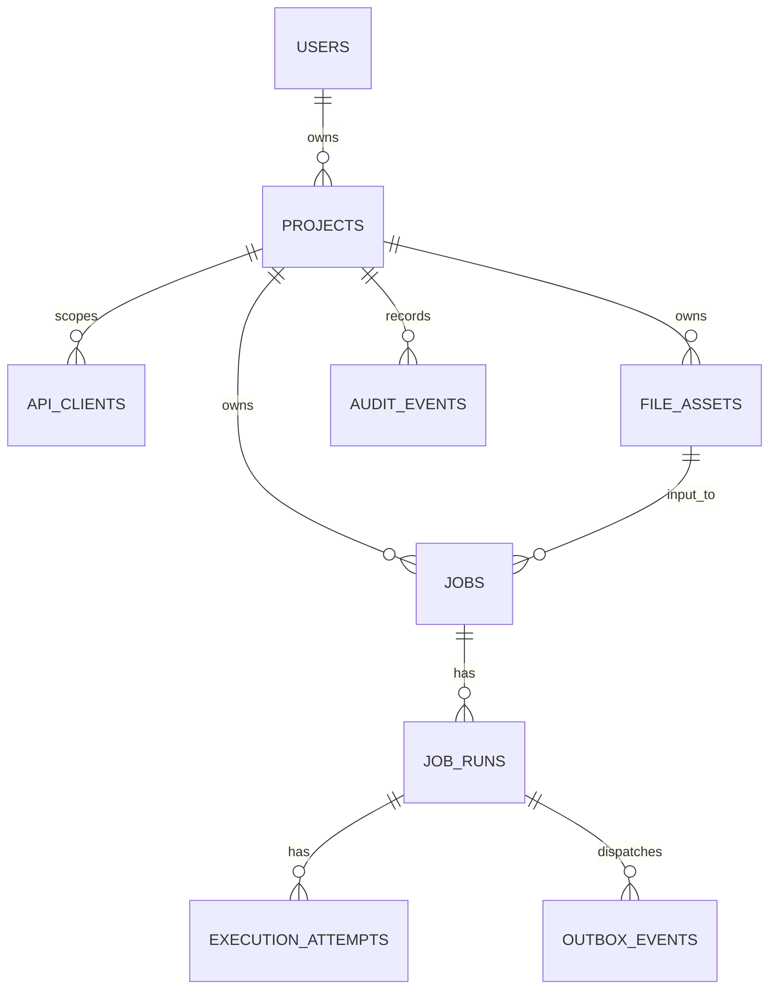

# Database Design and Migration Plan

## 1. Entity relationships

## 2. Tables

### `users`

`id uuid primary key`, `email varchar(320) unique not null`, `password_hash varchar(255) not null`, `role varchar(20) not null`, `created_at timestamptz not null`.

### `refresh_tokens`

Opaque refresh tokens are never stored in plaintext.

`id uuid primary key`, `user_id uuid not null references users`, `family_id uuid not null`, `parent_token_id uuid references refresh_tokens`, `token_hash char(64) not null unique`, `issued_at timestamptz not null`, `expires_at timestamptz not null`, `revoked_at timestamptz`, `replaced_by_token_id uuid`, `last_used_at timestamptz`.

Index: `(user_id, family_id, revoked_at)`. A refresh transaction locks the presented row, validates expiry/revocation, revokes it, inserts its child in the same family, and returns the child plaintext once. Reuse of a revoked token revokes every active token in that family.

### `projects`

Personal projects are the concrete MVP ownership boundary. An account may have many projects; no organization table is needed yet.

`id uuid primary key`, `owner_id uuid not null references users`, `name varchar(100) not null`, `status varchar(20) not null`, `created_at timestamptz not null`.

Unique: `(owner_id, name)`.

### `api_clients`

`id uuid primary key`, `project_id uuid not null references projects`, `name varchar(100) not null`, `key_prefix varchar(16) not null unique`, `key_hash varchar(255) not null`, `status varchar(20) not null`, `last_used_at timestamptz`, `created_at timestamptz not null`, `revoked_at timestamptz`.

Unique: `(project_id, name)`.

### `jobs`

`id uuid primary key`, `project_id uuid not null references projects`, `job_type varchar(50) not null`, `payload jsonb not null`, `payload_hash char(64) not null`, `status varchar(20) not null`, `priority smallint not null`, `scheduled_at timestamptz`, `idempotency_key varchar(128) not null`, `cancel_requested_at timestamptz`, `created_at timestamptz not null`, `updated_at timestamptz not null`, `completed_at timestamptz`.

Unique: `(project_id, idempotency_key)`.
Indexes: `(status, scheduled_at) where status = 'PENDING'`, `(project_id, created_at desc)`, `(status, priority, created_at)`.

### `file_assets`

File bytes live in private object storage; this table is the durable, project-authorised file identity.

`id uuid primary key`, `project_id uuid not null references projects`, `kind varchar(30) not null`, `storage_key varchar(512) not null unique`, `original_filename varchar(255) not null`, `content_type varchar(100) not null`, `size_bytes bigint not null`, `sha256 char(64) not null`, `row_count integer`, `header_json jsonb`, `created_by uuid not null references users`, `created_at timestamptz not null`, `expires_at timestamptz`, `deleted_at timestamptz`.

Kinds: `SOURCE_CSV`, `CLEANED_CSV`, `ERROR_CSV`, `REPORT`. Indexes: `(project_id, created_at desc)`, `(project_id, sha256)`, `(expires_at) where deleted_at is null`.

`PROCESS_FILE` payload must contain `sourceAssetId`; the handler verifies that it resolves to a non-expired `SOURCE_CSV` in the same project. It must never consume a caller-supplied storage URL.

### `job_runs`

One automatic retry chain. `effect_id` is immutable within a run and is sent to any external provider.

`id uuid primary key`, `job_id uuid not null references jobs`, `run_number integer not null`, `effect_id uuid not null unique`, `status varchar(20) not null`, `max_attempts smallint not null`, `attempt_count smallint not null default 0`, `dispatch_version integer not null default 0`, `next_dispatch_at timestamptz`, `manual_retry_key varchar(128)`, `created_at timestamptz not null`, `completed_at timestamptz`.

Unique: `(job_id, run_number)` and partial unique `(job_id, manual_retry_key) where manual_retry_key is not null`.
Indexes: `(status, next_dispatch_at) where status in ('RETRY_WAIT','QUEUED')` and `(job_id, run_number desc)`.

### `execution_attempts`

`id uuid primary key`, `run_id uuid not null references job_runs`, `attempt_number smallint not null`, `worker_id uuid`, `worker_epoch uuid`, `lease_token uuid`, `lease_expires_at timestamptz`, `status varchar(30) not null`, `started_at timestamptz`, `finished_at timestamptz`, `error_code varchar(64)`, `error_message text`, `result_json jsonb`, `result_ref text`, `created_at timestamptz not null`.

Unique: `(run_id, attempt_number)`.
Indexes: `(status, lease_expires_at) where status = 'RUNNING'` and `(run_id, created_at desc)`.

`result_json` is immutable after terminal finalisation and must validate against `contracts/handler-results.v1.json`. `result_ref` is optional and points to a large report/file `file_assets.id`; it is not a substitute for structured result data.

### `outbox_events`

`id uuid primary key`, `aggregate_type varchar(50) not null`, `aggregate_id uuid not null`, `event_type varchar(50) not null`, `payload jsonb not null`, `dedupe_key varchar(180) not null unique`, `created_at timestamptz not null`, `published_at timestamptz`, `publish_attempts integer not null default 0`, `last_error text`, `locked_until timestamptz`.

For a job dispatch, `dedupe_key = run_id + ':' + dispatch_version`. Index: `(published_at, locked_until, created_at) where published_at is null`.

### `workers` and `audit_events`

`workers`: `id`, `instance_name`, `worker_epoch`, `last_heartbeat_at`, `started_at`, `status`.

`audit_events`: `id`, `project_id`, `actor_type`, `actor_id`, `event_type`, `resource_type`, `resource_id`, `metadata jsonb`, `created_at`. Audit records are append-only.

## 3. Migration strategy

- Use Flyway versioned SQL migrations; never use `ddl-auto=update` outside local experiments.
- Expand/contract every breaking change across two releases: add compatible fields first, backfill, deploy readers/writers, then remove old fields later.
- Each migration must have fresh-install and upgrade-from-previous-version integration tests.
- Migration runs once before API, dispatcher, and worker deployment. If it fails, no application container starts.

## 4. Retention and deletion

- Retain job metadata 90 days, attempt logs 30 days, outbox rows 14 days after publication, and DLQ investigation records 14 days.
- Purge artifacts before attempt metadata only after policy allows it.
- User deletion is soft-delete/anonymisation in MVP; hard deletion is deferred until audit/artifact obligations are designed.
